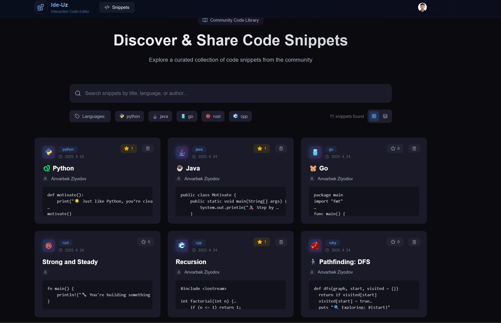
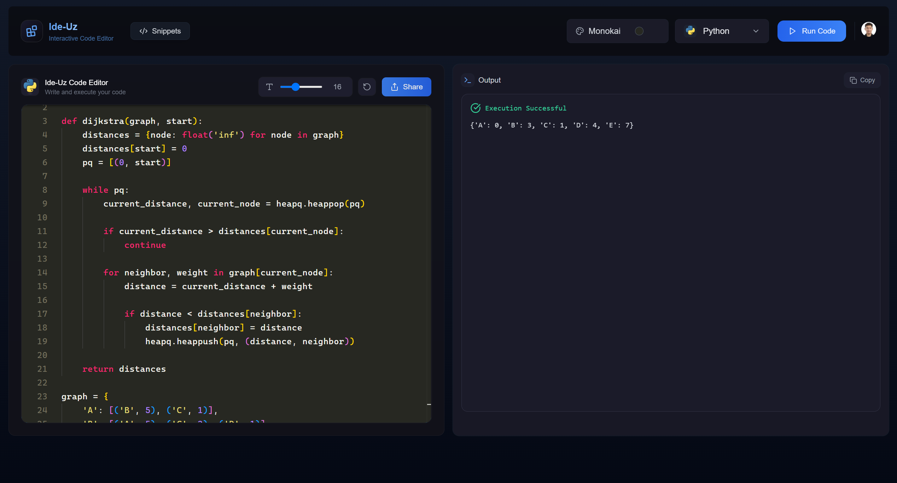
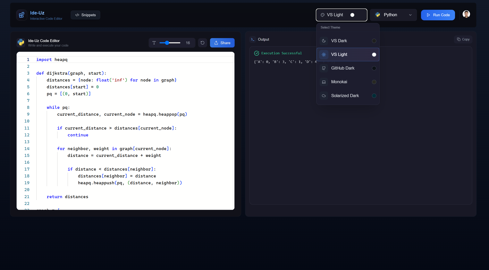
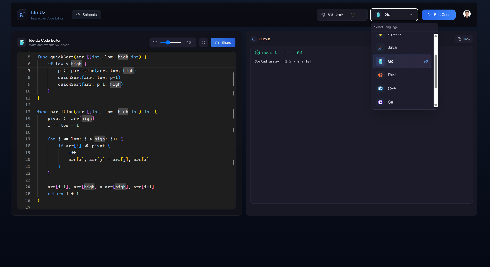
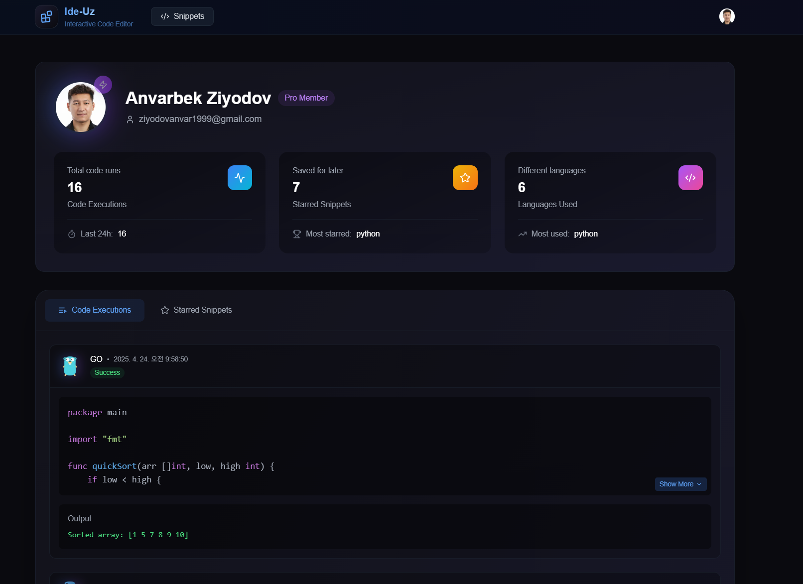
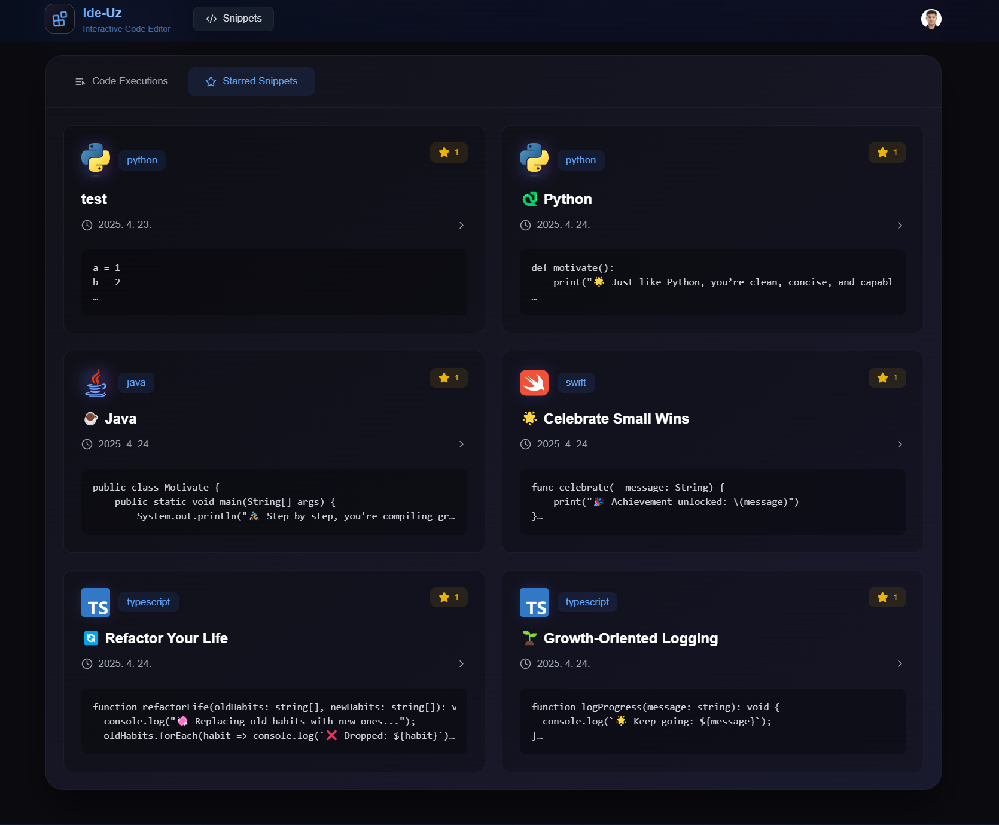
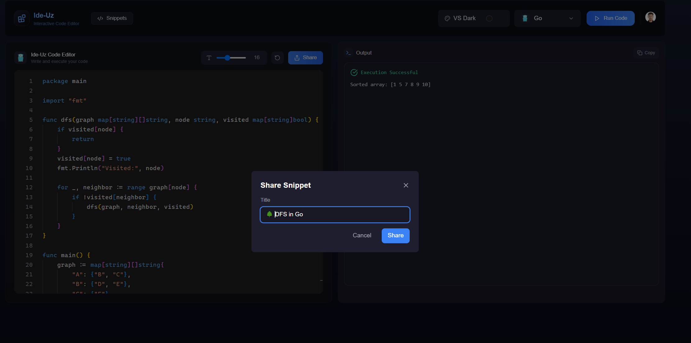
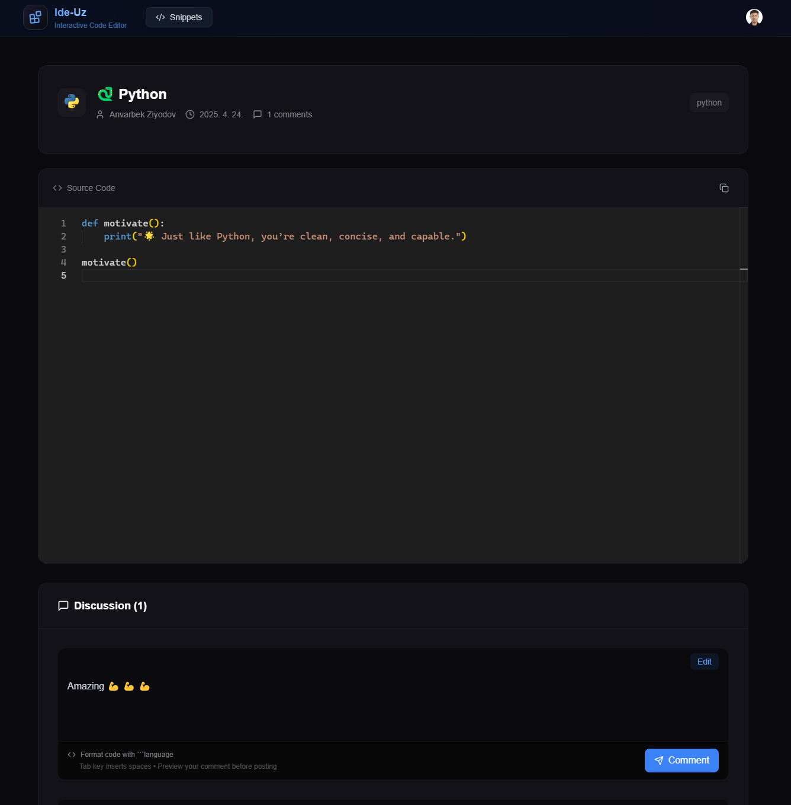

# Ide-uz

<p align="center">
    <a href="/">
        
    </a>
</p>

**Ide-uz** is a modern, full-featured web-based code editor and collaborative platform built using **Next.js 15**, **React 19**, and **Monaco Editor**. It supports real-time coding, syntax highlighting, secure authentication, and snappy UI animations to create a productive developer experience.

---

## 🔥 Highlights

🚀 Tech stack: Next.js 15 + Convex + Clerk + TypeScript  
💻 Online IDE with multi-language support (10 languages)  
🎨 Customizable experience with 5 VSCode themes  
✨ Smart output handling with Success & Error states  
💎 Flexible pricing with Free & Pro plans  
🤝 Community-driven code sharing system  
🔍 Advanced filtering & search capabilities  
👤 Personal profile with execution history tracking  
📊 Comprehensive statistics dashboard  
⚙️ Customizable font size controls  
🔗 Webhook integration support  
🌟 Professional deployment walkthrough

## 🚀 Tech Stack

### Frontend

- **Next.js 15**: App router architecture with file-based routing and server components
- **React 19**: Latest features and performance enhancements
- **Tailwind CSS**: Utility-first styling
- **Framer Motion**: Smooth UI animations
- **Lucide-react**: Icon library for sleek visual components
- **Monaco Editor**: In-browser code editing experience (same as VSCode)
- **React Syntax Highlighter**: Syntax highlighting for code previews
- **Zustand**: Lightweight state management
- **React Hot Toast**: Minimal toast notifications

### Backend & Auth

- **Convex**: Real-time backend as a service with database + serverless functions
- **@clerk/nextjs**: Secure and powerful authentication for user management
- **Svix**: Webhooks as a service

---

## 🛠 Scripts

- `npm run dev`: Starts development server
- `npm run build`: Builds production-ready app
- `npm run start`: Starts the built application
- `npm run lint`: Lint checks with Next.js ESLint config

---

## 🧱 Folder Structure

```
/ide-uz
├── convex/              # Convex backend logic and schema definitions
│   ├── _generated/      # Auto-generated Convex types
│   ├── auth.config.ts   # Clerk authentication config
│   ├── codeExecutions.ts # Backend logic for executing code
│   ├── schema.ts        # Convex DB schema
│   └── ...              # Other server-side logic modules
├── public/              # Static files and assets
├── src/                 # Application source code
│   ├── app/             # App router layout (Next.js)
│   ├── components/      # Reusable UI components
│   ├── hooks/           # Custom React hooks
│   ├── store/           # Zustand store setup
│   ├── types/           # TypeScript types
│   └── middleware.ts    # Next.js middleware logic
├── .env.local           # Local environment variables
├── tailwind.config.ts   # Tailwind CSS config
├── tsconfig.json        # TypeScript compiler config
└── README.md            # Project documentation
```

---

## 📦 Deployment

Ide-uz is optimized for deployment on platforms like **Vercel**, but can also run on any Node-compatible server.

1. Install dependencies:
   ```bash
   npm install
   ```
2. Build the app:
   ```bash
   npm run build
   ```
3. Start production server:
   ```bash
   npm run start
   ```

---

## 🧪 Development Notes

- Using React 19 RC: ensure compatibility before major version updates
- Convex requires CLI login and project link: run `npx convex dev` to get started
- Clerk setup requires environment variables: check `.env.local`

---

## 📚 Roadmap Ideas

- Multi-file support in Monaco
- Real-time collaboration via WebSocket or CRDT
- Theme customization and dark/light toggle
- Role-based permissions for collaborative editing

---

## 🧠 Credits

Built by [Anvarbek](https://github.com/Mr-Perfectuz/ide-uz/tree/dev)
Special thanks to the open-source community and libraries that power this platform.

---

## 📃 License

MIT License. Feel free to fork and build your own version of Ide-uz!

<p align="center">
    <a href="/">
        
        
        
        
        
        
        
        
        
    </a>
</p>
